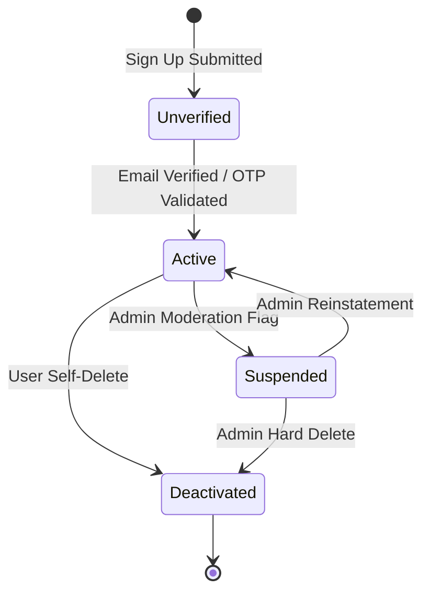
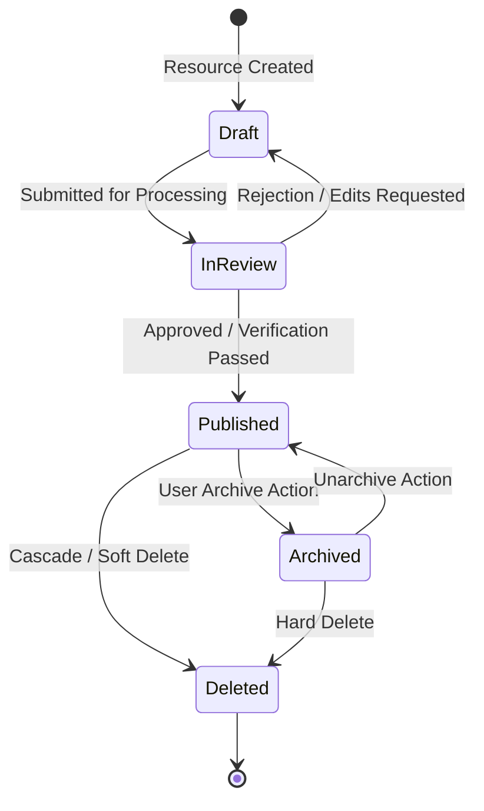

# Core Systems — Entity Lifecycles & State Machines

## 1. User Account Lifecycle

```mermaid
stateDiagram-v2
    [*] --> Unverified: Sign Up Submitted
    Unverified --> Active: Email Verified / OTP Validated
    Active --> Suspended: Admin Moderation Flag
    Suspended --> Active: Admin Reinstatement
    Active --> Deactivated: User Self-Delete
    Suspended --> Deactivated: Admin Hard Delete
    Deactivated --> [*]
```

## 2. Resource Item Lifecycle

```mermaid
stateDiagram-v2
    [*] --> Draft: Resource Created
    Draft --> InReview: Submitted for Processing
    InReview --> Published: Approved / Verification Passed
    InReview --> Draft: Rejection / Edits Requested
    Published --> Archived: User Archive Action
    Archived --> Published: Unarchive Action
    Published --> Deleted: Cascade / Soft Delete
    Archived --> Deleted: Hard Delete
    Deleted --> [*]
```
